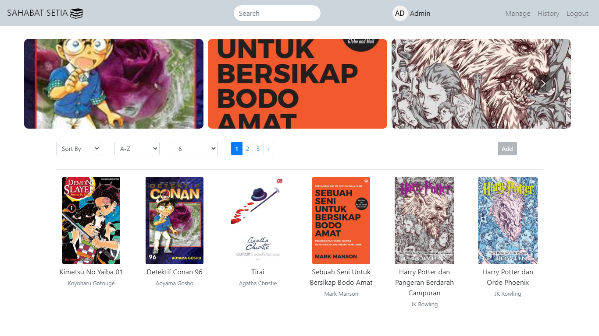
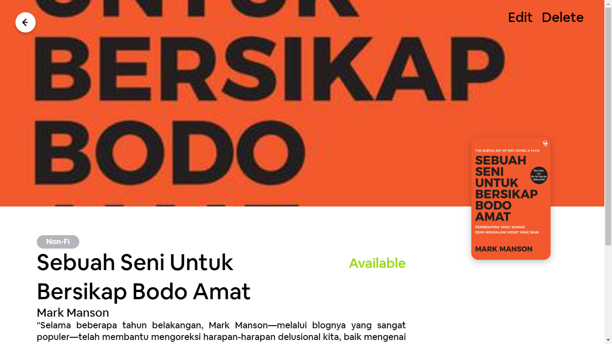
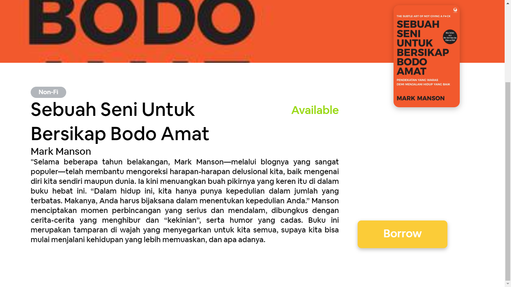
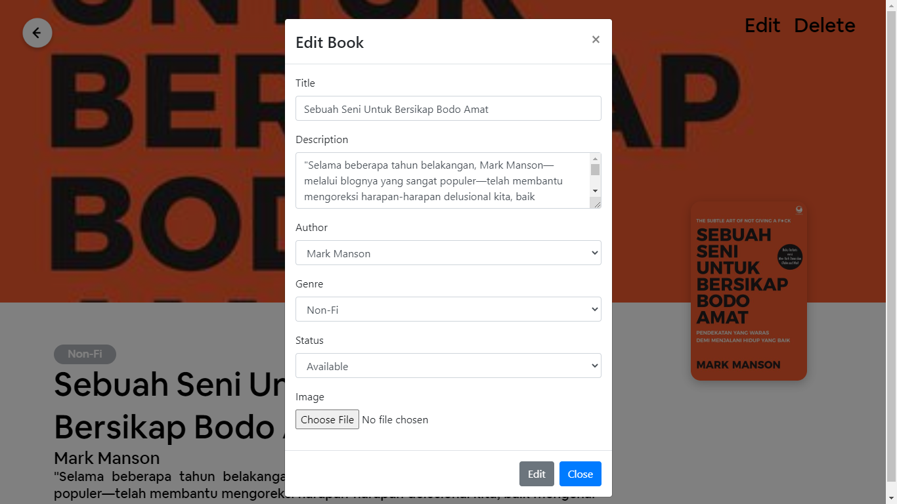
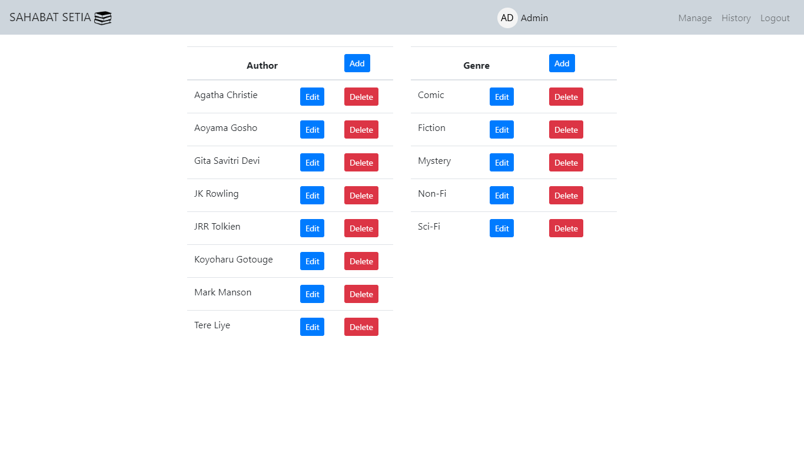
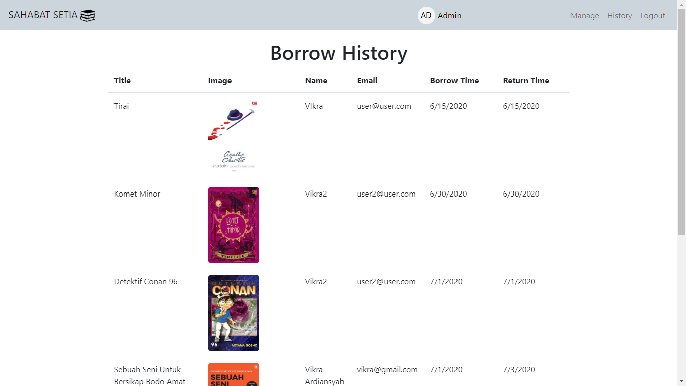
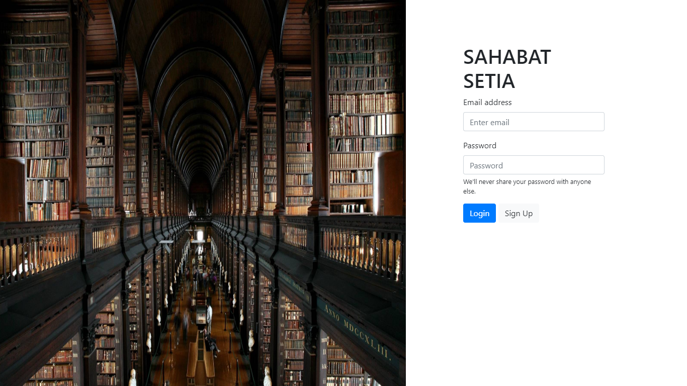

# Sahabat Setia

  Built with React.

## Introduction
Sahabat Setia is library web application that can borrow your favorite book, you can search your favorite book in search bar, you can see detail of book, and you can see history of book that you being borrowed

## Features
* Users can see books without login
* Users can borrow book if already logged in
* Users can return book being borrowed
* Users can see history of book being borrowed or borrowed
* Admin can CRUD book, author, and genre
* Admin can see history of book that user being borrowed
* Etc

## Requirements
* [npm](https://www.npmjs.com/get-npm)
* [react](https://reactjs.org/docs/create-a-new-react-app.html)

## Usage for development
1. Open your terminal or command prompt
2. Type `git clone https://github.com/Vikraardiansyah/sahabat-setia-app.git`
3. Open the folder and type `npm install` for install dependencies
4. Type `npm start` for run this app

## Screenshots

 
 
 
 
 
 
 

## Release Web
[Sahabat Setia](http://54.225.43.18/)

## Related Project (Backend)
[`Sahabat-Setia-Api`](https://github.com/Vikraardiansyah/sahabat-setia-api)

## Contributors
[Vikra Ardiansyah Zaini](https://github.com/Vikraardiansyah)
